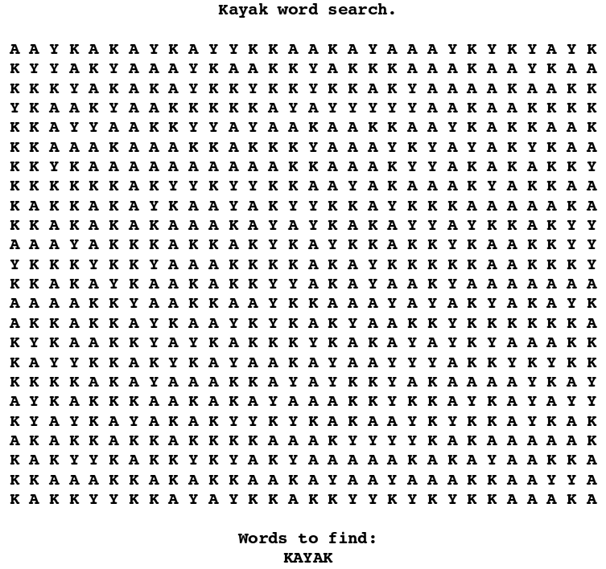

# terrible-word-search
> Create terrible word searches with ease.

## What is a "Terrible Word Search"
A "Terrible Word Search" is a word search where you are only finding one word, and all the letters on the word search itself are letters from the word. This was inspired from [Charles Lohr's C Program](https://pastebin.com/i2MBCHLQ) that was described in his [blog post](http://cnlohr.blogspot.com/2014/02/to-make-terrible-wordsearches.html).

Results of this could be the Kayak Word Search.

## How to Use
1. Go to https://terrible-word-search.netlify.com/.
2. Enter a word and dimensions.
3. Click generate.

*Generating some word searches may take a while. For example, words that are short, have a lot of similar characters, and a big area, will take a long time to make.*

## Technical Aspect
I know it isn't the best way of generating the word searches, **BUT** the way I generate the word searches is to **first fill the word seach with characters from the actual word**. From then we can **check each letter and see if next letter in the word is next to it**. If so, **check the next letter in the same direction**. If the word is found, it is added to the number of occurences of that word. At the end after checking all the letters, if there is more than one or zero occurances of the word, we regenerate the word search and repeat.
